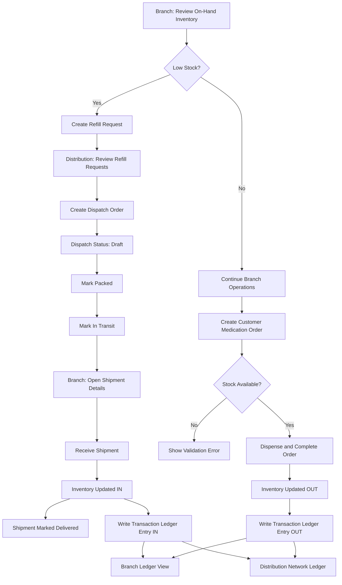

# Inventory and Dispatch Flow

## Purpose
This document summarizes how inventory moves through the system across branch pharmacies and the distribution center.

## Roles
- Branch Pharmacy: manages local inventory, serves customer orders, submits refill requests, receives inbound shipments.
- Distribution Center: monitors branch health, creates and updates dispatches, and views network-wide movement.

## Core Data Objects
- Store Inventory: on-hand quantity and weekly outflow per medication and branch.
- Customer Orders: fulfilled branch orders that reduce branch stock.
- Refill Requests: branch requests for replenishment.
- Shipping Orders: dispatches created from refill requests.
- Inventory Transactions: line-level IN/OUT movement log per medication, branch, and reference.

## End-to-End Flow

### 1. Branch Dispensing (OUT movement)
1. User creates a customer medication order.
2. System validates required fields and stock availability.
3. System deducts quantities from branch inventory.
4. System stores customer order history.
5. System writes transaction log entries (`OUT`) for each medication line item.

Reference source: `serveCustomerOrder` in state provider.

### 2. Branch Replenishment Request
1. Branch reviews low-stock medications.
2. Branch submits a refill request to distribution.
3. Request enters pending workflow for dispatch planning.

Reference source: `createReorderRequest` and Store Reorder route.

### 3. Distribution Dispatch Creation
1. Distribution reviews pending/approved refill requests without existing dispatches.
2. Distribution creates dispatch order from selected request.
3. Dispatch starts in `Draft` or `Packed` (depending on action path).
4. Request status is synchronized with dispatch progression.

Reference source: `createShippingOrder` and Warehouse Shipping route.

### 4. Dispatch Lifecycle
Allowed shipping status transitions:
- `Draft` -> `Packed`
- `Packed` -> `In Transit`
- `In Transit` -> `Delivered`

Reference source: `updateShippingStatus`.

### 5. Branch Receiving (IN movement)
1. Branch opens shipment details from inbound list (`Packed` or `In Transit`).
2. Branch confirms receiving.
3. System increases branch on-hand inventory for each shipment line item.
4. Shipment status is set to `Delivered`.
5. System writes transaction log entries (`IN`) for each received medication line item.

Reference source: `receiveShipment` and Store Inventory route.

## Flowchart

## Inventory Transaction Ledger
Each movement entry includes:
- Transaction ID
- Branch ID
- Medication/Product ID
- Movement type: `IN` or `OUT`
- Quantity
- Timestamp
- Reference (shipment ID, order ID, or adjustment source)
- Note

### Where It Appears
- Branch view: Branch-specific item movement ledger in Store Inventory.
- Distribution view: Network item movement ledger across all branches in Branch Monitoring.

## Status Mapping

### Refill Request Statuses
- `Pending`: awaiting dispatch creation.
- `Approved`: eligible for dispatch.
- `Fulfilled`: replenishment completed.

### Shipping Order Statuses
- `Draft`, `Packed`, `In Transit`, `Delivered`

## Persistence
All state is persisted in local storage key:
- `inventory-shipping-prototype-state-v1`

Persisted domains include:
- Store inventory
- Customer orders
- Refill requests
- Shipping orders
- Inventory transactions
- Selected role and branch context

## User-Facing Screens (Functional Map)
- Branch Dashboard: local stock pulse and quick navigation.
- Branch Inventory: inventory table, inbound shipments, branch transaction ledger.
- Branch Customer Orders: order creation and editable order grid.
- Branch Refill Requests: low-stock based request submission.
- Distribution Dashboard: request and shipping overview.
- Distribution Branch Monitoring: branch heat list and network ledger.
- Distribution Dispatch Orders: dispatch creation, queue management, status progression.

## Operational Notes
- Customer order creation is stock-protected; orders fail when branch stock is insufficient.
- Receiving is allowed only for shipments in `Packed` or `In Transit`.
- Transaction ledger entries are generated automatically by inventory-affecting actions.
