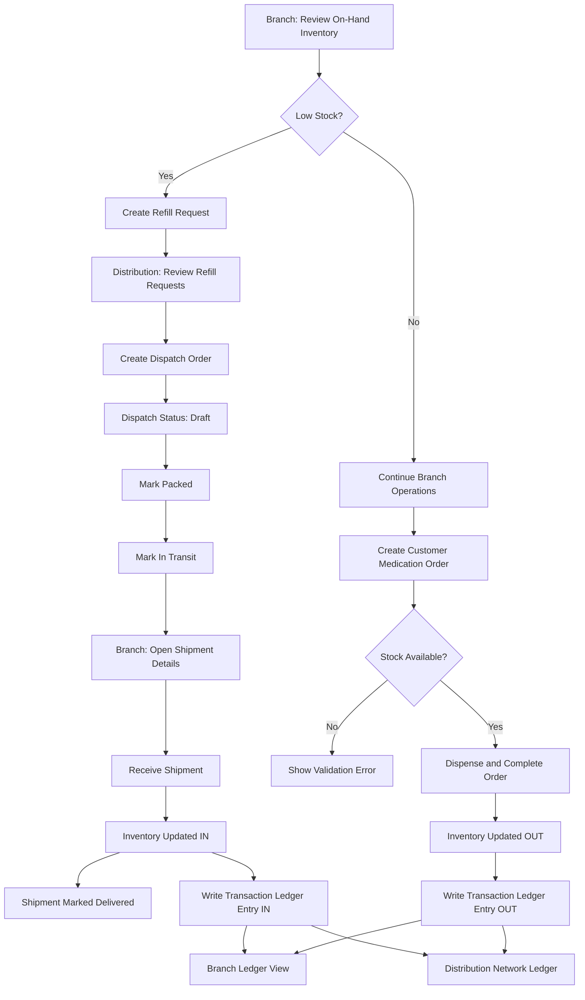

# Inventory and Dispatch Flow

## Purpose
This document summarizes how inventory moves through the system across branch pharmacies and the distribution center.

## Terminology Source
- Expiration and traceability terms used in this document are defined in `docs/glossary.md`.

## Roles
- Branch Pharmacy: manages local inventory, serves customer orders, submits refill requests, receives inbound shipments.
- Distribution Center: monitors branch health, creates and updates dispatches, and views network-wide movement.

## Core Data Objects
- Store Inventory: on-hand quantity and weekly outflow per medication and branch.
- Inventory Batches: batch-level quantity and expiration date used for FEFO and expiry risk decisions.
- Customer Orders: fulfilled branch orders that reduce branch stock.
- Refill Requests: branch requests for replenishment.
- Shipping Orders: dispatches created from refill requests, with required shipment lines carrying batch ID and expiry date.
- Inventory Transactions: line-level IN/OUT movement log per medication, branch, and reference.

## End-to-End Flow

### 1. Branch Dispensing (OUT movement)
1. User creates a customer medication order.
2. System validates required fields and stock availability.
3. System blocks dispensing from expired batches.
4. System warns if selected stock is near-expiry but still allows completion by policy.
5. System applies FEFO and deducts quantities from earliest non-expired batches first.
6. System stores customer order history with per-batch dispense lines.
7. System writes transaction log entries (`OUT`) for each medication line item.

Reference source: `serveCustomerOrder` in state provider.

### 2. Branch Replenishment Request
1. Branch reviews low-stock medications.
2. Branch submits a refill request to distribution.
3. Request enters pending workflow for dispatch planning.

Reference source: `createReorderRequest` and Store Reorder route.

### 3. Distribution Dispatch Creation
1. Distribution reviews pending/approved refill requests without existing dispatches.
2. Distribution creates dispatch order from selected request.
3. System generates FEFO-ready dispatch batch lines with batch IDs and expiry dates.
4. Distribution reviews FEFO batch preview before saving or confirming dispatch.
5. Distribution cannot include expired batches in dispatch.
6. Distribution sees warning context for near-expiry batches before confirmation.
7. Dispatch starts in `Draft` or `Packed` (depending on action path).
8. Request status is synchronized with dispatch progression.

Shipment line requirement:
- Every shipment item must include batch ID and expiry date before it can be used in branch receiving quality checks.

Reference source: `createShippingOrder` and Warehouse Shipping route.

### 4. Dispatch Lifecycle
Allowed shipping status transitions:
- `Draft` -> `Packed`
- `Packed` -> `In Transit`
- `In Transit` -> `Delivered`

Reference source: `updateShippingStatus`.

### 5. Branch Receiving (IN movement)
1. Branch opens shipment details from inbound list (`Packed` or `In Transit`).
2. Branch quality check validates that every shipment line has batch ID and expiry date.
3. Branch confirms receiving.
4. System increases branch on-hand inventory for each shipment line item at batch level.
5. Shipment status is set to `Delivered`.
6. System writes transaction log entries (`IN`) for each received medication line item.

Reference source: `receiveShipment` and Store Inventory route.

## Flowchart

## Inventory Transaction Ledger
Each movement entry includes:
- Transaction ID
- Branch ID
- Medication/Product ID
- Batch ID (when available)
- Expiration Date (when available)
- Movement type: `IN` or `OUT`
- Quantity
- Timestamp
- Reference (shipment ID, order ID, or adjustment source)
- Note

`OUT` entries from dispensing include FEFO source batch details.
`IN` entries from receiving include inbound batch and expiry metadata.

### Where It Appears
- Branch view: Branch-specific item movement ledger in Store Inventory.
- Distribution view: Network item movement ledger across all branches in Branch Monitoring.

## Status Mapping

### Refill Request Statuses
- `Pending`: awaiting dispatch creation.
- `Approved`: eligible for dispatch.
- `Fulfilled`: replenishment completed.

### Shipping Order Statuses
- `Draft`, `Packed`, `In Transit`, `Delivered`

## Persistence
All state is persisted in local storage key:
- `inventory-shipping-prototype-state-v1`

Persisted domains include:
- Store inventory
- Customer orders
- Refill requests
- Shipping orders
- Inventory transactions
- Selected role and branch context

## User-Facing Screens (Functional Map)
- Branch Dashboard: local stock pulse and quick navigation.
- Branch Inventory: inventory table, inbound shipments, branch transaction ledger.
- Branch Customer Orders: order creation and editable order grid.
- Branch Refill Requests: low-stock based request submission.
- Distribution Dashboard: request and shipping overview.
- Distribution Branch Monitoring: branch heat list and network ledger.
- Distribution Dispatch Orders: dispatch creation, queue management, status progression.

## Operational Notes
- Customer order creation is stock-protected; orders fail when branch stock is insufficient.
- Customer order creation blocks expired stock and warns for near-expiry stock based on configured threshold.
- FEFO applies to dispensing for eligible non-expired stock.
- Dispatch creation includes FEFO batch preview to expose planned batch and expiry lines before confirmation.
- Shipment metadata policy: every shipment line must include batch ID and expiry date for pharmacy quality checks.
- Receiving is allowed only for shipments in `Packed` or `In Transit`.
- Transaction ledger entries are generated automatically by inventory-affecting actions.
